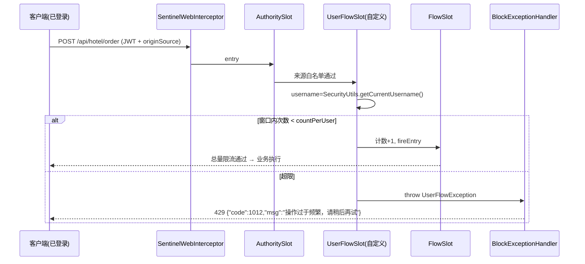
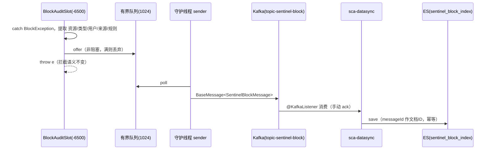

# Sentinel 自定义 UserFlowSlot 设计与实现（用户维度防刷限流）

> 基于 Sentinel ProcessorSlot SPI 扩展机制，为 sca-web 增加"按登录用户限流"能力，
> 防止单个恶意用户高频调用下单接口（Seata TCC 全局事务 + 库存冻结），把接口总配额吃满或锁死库存。

## 1. 背景与问题

项目现有三层 Sentinel 防护及其缺口：

| 防护层 | 机制 | 能做什么 | 缺口 |
|---|---|---|---|
| FlowSlot | URL 资源限流（Nacos: `sca-web-sentinel-flow`） | 限制接口**总 QPS** | 单个恶意用户可吃满全部配额，挤掉正常用户 |
| DegradeSlot | 熔断降级（Nacos: `sca-web-sentinel-degrade`） | 依赖异常时快速失败 | 不区分调用者 |
| AuthoritySlot | 来源授权（请求头 `originSource`，Nacos: `sca-web-sentinel-authority`） | 拦截非 sc-web 的外部来源 | origin 维度已被来源标识占用，无法复用 `limitApp` 做用户维度流控 |

内置 ParamFlowSlot（热点参数限流）本可按 userId 限流，但它依赖 `SphU.entry(res, args)` 显式传参；
本项目采用 URL 资源方案（`SentinelWebInterceptor` 自动埋点，不传业务参数），热点规则挂不上。
**因此"用户维度限流"必须通过自定义 ProcessorSlot 实现。**

## 2. 目标

1. 对指定 URL 资源（如 `POST /api/hotel/order`、`/api/hotel/order/tcc`）按 **(资源, 用户名)** 维度做窗口计数限流，例如"每用户 60 秒内最多下单 5 次"。
2. 规则由 Nacos 动态推送，热更新不重启（与现有 flow/degrade/authority 规则管理方式一致）。
3. 被拦截请求统一返回 `429 + code 1012（操作过于频繁，请稍后再试）`，与现有 403/429 分层保持一致。
4. 未登录/匿名请求不受此 Slot 影响（登录校验由 Spring Security 负责，职责不混淆）。

## 3. 方案设计

### 3.1 Slot 链编排

Sentinel 1.8.6 通过 `@Spi(order=...)` + `META-INF/services/com.alibaba.csp.sentinel.slotchain.ProcessorSlot`
文件注册自定义 Slot，`DefaultSlotChainBuilder` 会合并 classpath 上所有注册项并按 order 升序编排：

| Slot | order | 职责 |
|---|---|---|
| NodeSelectorSlot | -10000 | 构建调用树 |
| ClusterBuilderSlot | -9000 | 构建集群节点 |
| LogSlot | -8000 | 日志 |
| StatisticSlot | -7000 | 指标统计 |
| **BlockAuditSlot（自定义，观测型）** | **-6500** | **拦截事件审计（见第 8 章）** |
| AuthoritySlot | -6000 | 来源授权（originSource） |
| SystemSlot | -5000 | 系统保护 |
| ParamFlowSlot | -3000 | 热点参数限流（本项目未启用规则） |
| **UserFlowSlot（自定义）** | **-2500** | **用户维度限流** |
| FlowSlot | -2000 | URL 总量限流 |
| DegradeSlot | -1000 | 熔断降级 |

order 取 **-2500** 的理由：
- 在 AuthoritySlot 之后 —— 来源不合法的请求先被 403 拦截，无需浪费用户维度计数；
- 在 FlowSlot 之前 —— 恶意用户先被单独拦截，**不占用接口总 QPS 配额**，保护正常用户；
- 避开 ParamFlowSlot 的 -3000（sentinel-parameter-flow-control 在 classpath 上）。

### 3.2 用户身份获取

`SentinelWebInterceptor` 是 Spring HandlerInterceptor，执行时 `JwtAuthenticationFilter`（Servlet Filter）
已完成认证，Slot 链与 Controller 同线程，直接调用 `SecurityUtils.getCurrentUsername()`
（底层 `SecurityContextHolder`，MODE_THREADLOCAL）即可拿到用户名，**无需改造任何埋点**。

跳过规则（fail-open，不做登录校验）：
- `username == null`（未登录）或 `"anonymousUser"`（Spring Security 匿名令牌）→ 直接放行；
- 资源无用户限流规则 → 直接放行；
- 仅处理 `EntryType.IN` 的入站资源（Feign 出站资源 `EntryType.OUT` 不参与）。

### 3.3 计数算法：固定窗口

按 `resource|username` 维护固定窗口计数器（窗口起点对齐 + AtomicInteger）：
- 防刷场景的阈值是"分钟级少量次数"，固定窗口的临界突刺（最坏 2 倍）影响可接受，换来实现简单、无锁高并发；
- 计数器存于 `ConcurrentHashMap`，后台守护线程每 5 分钟清理过期窗口，防止内存增长；
- 规则热更新（窗口长度/阈值变化）后，旧窗口按新规则自然轮替，无需清空。

### 3.4 规则模型与 Nacos 动态数据源

规则格式（Data ID: `sca-web-sentinel-userflow`，Group: `SENTINEL_GROUP`，JSON）：

```json
[
  {"resource": "/api/hotel/order",         "countPerUser": 5, "windowSeconds": 60},
  {"resource": "/api/hotel/order/tcc",     "countPerUser": 5, "windowSeconds": 60},
  {"resource": "/api/sentinel/test/userflow", "countPerUser": 3, "windowSeconds": 10}
]
```

| 字段 | 说明 |
|---|---|
| resource | 受保护 URL 资源，与现有限流规则写法一致（RESTful 路径变量写 `{id}`） |
| countPerUser | 单个用户在一个窗口内允许的最大请求次数 |
| windowSeconds | 窗口长度（秒） |

**为什么不走 `spring.cloud.sentinel.datasource` 配置？** starter 的 `rule-type` 枚举仅支持
flow/degrade/authority/system/param-flow 等内置类型，自定义规则类型无法声明。
因此仿照 `FlowRuleManager` 模式实现 `UserFlowRuleManager`（`SentinelProperty` + `PropertyListener`），
由 `SentinelUserFlowConfig` 在启动时手工创建 `NacosDataSource`（复用 bootstrap.yml 中的
Nacos 地址与账号）并注册，行为与内置规则完全一致：启动拉取 + 长轮询热更新。

### 3.5 请求处理流程



### 3.6 异常与响应分层

| 拦截原因 | 异常 | HTTP | code |
|---|---|---|---|
| 来源不在白名单 | AuthorityException | 403 | 1005 |
| **单用户超限（新增）** | **UserFlowException** | **429** | **1012** |
| 接口总量限流/熔断 | FlowException/DegradeException | 429 | 1010 |

`UserFlowException` 继承 `BlockException`，`ruleLimitApp` 位携带触发用户名，`rule` 位携带命中的
`UserFlowRule`（`UserFlowRule` 继承 `AbstractRule`，天然兼容 `BlockException.getRule()` 与现有日志）。

## 4. 代码清单

| 文件 | 说明 |
|---|---|
| `sca-web/.../web/sentinel/UserFlowRule.java` | 规则模型（继承 AbstractRule） |
| `sca-web/.../web/sentinel/UserFlowException.java` | BlockException 子类 |
| `sca-web/.../web/sentinel/UserFlowRuleManager.java` | 规则管理器（SentinelProperty 监听模式） |
| `sca-web/.../web/sentinel/UserFlowChecker.java` | 固定窗口计数器 + 过期清理 |
| `sca-web/.../web/sentinel/UserFlowSlot.java` | 自定义 Slot（@Spi(order=-2500)） |
| `sca-web/src/main/resources/META-INF/services/com.alibaba.csp.sentinel.slotchain.ProcessorSlot` | SPI 注册文件 |
| `sca-web/.../web/config/SentinelUserFlowConfig.java` | NacosDataSource 装配 |
| `sca-web/.../web/config/SentinelConfig.java` | BlockExceptionHandler 新增 1012 分支；启动打印用户限流规则 |
| `sca-common/.../exception/SystemErrorType.java` | 新增 `USER_RATE_LIMIT(1012)` |
| `sca-web/.../controller/hotel/SentinelTestController.java` | 新增 `/api/sentinel/test/userflow` 测试接口 |
| `docker-compose/sentinel/sca-web-sentinel-userflow.json` | Nacos 规则模板 |

## 5. 实施步骤

1. sca-common：新增错误码 `USER_RATE_LIMIT(1012, "操作过于频繁，请稍后再试")`。
2. sca-web：新建 `web/sentinel` 包，实现规则模型、异常、规则管理器、窗口计数器、自定义 Slot。
3. sca-web：新增 SPI 注册文件（Sentinel SpiLoader 会与 sentinel-core 内置注册项合并）。
4. sca-web：新增 `SentinelUserFlowConfig`，启动时注册 NacosDataSource（`sca-web-sentinel-userflow`）。
5. sca-web：`SentinelConfig` 的 BlockExceptionHandler 增加 `UserFlowException` 分支；规则打印补充。
6. 测试支撑：`SentinelTestController` 新增 `/userflow` 接口；`docker-compose/sentinel/` 新增规则模板。
7. Nacos 发布规则（Data ID: `sca-web-sentinel-userflow`，Group: `SENTINEL_GROUP`，格式 JSON）。
8. `mvn compile` 编译验证 + 启动后按第 6 节验证。

## 6. 测试方案

前置：sca-web 启动、Nacos 已发布 userflow 规则（含 `/api/sentinel/test/userflow`，3 次/10 秒）。

```bash
# 1. 登录拿 Token
TOKEN=$(curl -s -X POST http://localhost:8080/api/auth/login \
  -H "Content-Type: application/json" -d '{"username":"...","password":"..."}' | jq -r .data.accessToken)

# 2. 同一用户连续请求 4 次：前 3 次 200，第 4 次 429 + code 1012
for i in 1 2 3 4; do
  curl -s -o /dev/null -w "%{http_code}\n" \
    -H "Authorization: Bearer $TOKEN" -H "originSource: sc-web" \
    http://localhost:8080/api/sentinel/test/userflow
done

# 3. 换另一个用户的 Token 立即请求 → 200（用户间配额互不影响）
# 4. 不带 Token 请求 → 200（匿名请求不受用户限流约束，测试接口在登录白名单内）
# 5. 等待 10 秒窗口轮替后再请求 → 200
```

启动日志验证：`[Sentinel] 已加载用户限流规则 N 条`；触发拦截时输出
`[Sentinel] 用户维度限流触发: uri=..., user=...`。

## 7. 边界与风险

- **fail-open 设计**：取不到用户名（未登录、匿名、非 Web 线程）一律放行，本 Slot 只做"已登录用户防刷"，不承担认证职责。
- **内存**：计数器条目数 ≈ 活跃用户数 × 受保护资源数，条目仅含长整型与计数器，配合 5 分钟过期清理，可忽略。
- **集群**：计数为单节点内存态。当前 sca-web 单实例部署下即全局精确；将来多实例时阈值近似为 `countPerUser × 实例数`（网关轮询摊薄），如需精确集群限流可演进为 Redis 窗口计数，规则模型不变。
- **规则热更新**：Nacos 长轮询推送，`UserFlowRuleManager` 原子替换规则表，无需重启。

## 8. 扩展二：拦截事件审计 BlockAuditSlot（观测型）

在 Slot 链中再挂一个**观测型 Slot**，把限流/熔断/授权拦截事件（谁、什么时候、哪个接口、
命中哪条规则）异步推到 Kafka → ES，复用项目已有的 sca-datasync / sca-es 基础设施。
它不改变流控行为，任何环节失败都 fail-open，风险为零。

### 8.1 编排位置：为什么在拦截型 Slot 之前（order = -6500）

直觉上"审计拦截事件"应挂在链末尾，但 BlockException 是从下游 Slot **沿调用栈向上抛**的，
链末尾的 Slot 根本抓不到它。正确做法与内置 LogSlot(-8000) 相同：把自己放在拦截型 Slot
**之前**，对 `fireEntry` 做 try-catch，捕获后记录事件再原样抛出：

- order = **-6500**：在 StatisticSlot(-7000) 之后、AuthoritySlot(-6000) 之前；
- 可覆盖下游全部拦截型 Slot：Authority(-6000) / System(-5000) / ParamFlow(-3000) /
  **UserFlow(-2500)** / Flow(-2000) / Degrade(-1000)；
- 只 catch `BlockException` 并原样 rethrow，业务异常不经过审计逻辑。

### 8.2 事件链路



异步隔离细节：Slot 线程只做非阻塞 `offer`，Kafka 发送由守护线程 `sentinel-block-audit-sender`
完成；生产者 `max.block.ms=3000` 快速失败，Kafka 宕机时最多积压 1024 条后静默丢弃，
业务请求链路零感知。

### 8.3 事件模型

Kafka 消息复用项目统一信封 `BaseMessage<SentinelBlockMessage>`（eventType = `SENTINEL_BLOCK`）：

| 字段 | 说明 | 示例 |
|---|---|---|
| app | 触发拦截的服务名 | sca-web |
| resource | 被拦截的 URL 资源 | /api/hotel/order |
| blockType | 拦截类型 | FLOW / DEGRADE / AUTHORITY / USER_FLOW / PARAM_FLOW / SYSTEM |
| username | 登录用户名（匿名为 null） | zhangsan |
| origin | 调用来源（originSource 解析结果） | sc-web / unknown |
| ruleInfo | 命中规则 toString | UserFlowRule(resource=..., countPerUser=5...) |
| blockTime | 拦截时间戳（毫秒） | 1753772400000 |

ES 索引 `sentinel_block_index`：全 Keyword 字段 + blockTime Date，天然适合按用户/接口/类型
聚合分析（"最近 24h 被限流最多的用户 TOP10"一个 terms 聚合即可）。

### 8.4 代码清单

| 文件 | 说明 |
|---|---|
| `sca-common/.../message/EventType.java` | 新增 `SENTINEL_BLOCK` 事件类型 |
| `sca-common/.../message/SentinelBlockMessage.java` | 审计消息体（生产/消费两端共用） |
| `sca-web/.../web/sentinel/BlockAuditSlot.java` | 观测型 Slot（@Spi(order=-6500)，try-catch fireEntry） |
| `sca-web/.../web/sentinel/BlockAuditEventPublisher.java` | 静态桥接 + 有界队列 + 守护线程发 Kafka |
| `sca-web/.../web/config/KafkaProducerConfig.java` | Kafka 生产者（与 sca-order 同构，额外 max.block.ms=3000） |
| `sca-web/pom.xml` / `application.yml` | 新增 spring-kafka 依赖与 bootstrap-servers/topic 配置 |
| `META-INF/services/...ProcessorSlot` | 追加 BlockAuditSlot 注册行 |
| `sca-es/.../document/SentinelBlockDocument.java` | ES 文档（sentinel_block_index） |
| `sca-es/.../repository/SentinelBlockDocumentRepository.java` | ES Repository |
| `sca-datasync/.../listener/SentinelBlockAuditListener.java` | Kafka 消费 → 写 ES（messageId 幂等） |

### 8.5 验证步骤

1. 启动 Kafka（`docker-compose/kafka`）、ES（`docker-compose/es`）、sca-web、sca-datasync；
2. 按第 6 节方式触发一次用户限流（或去掉 originSource 头触发授权拦截）；
3. sca-web 日志出现拦截告警，sca-datasync 日志出现 `拦截审计已写入 ES`；
4. 查询验证：`GET http://<es>:9200/sentinel_block_index/_search?q=blockType:USER_FLOW`。

### 8.6 边界与风险

- **零侵入**：只读拦截信息，异常原样抛出；审计内部任何异常（含 Kafka 不可用）只记日志；
- **丢弃策略**：审计属旁路数据，队列满/发送失败直接丢，不重试不落盘（与订单事件的可靠性要求不同）；
- **幂等**：sca-datasync 重复消费时 messageId 作为 ES 文档 ID，重复写入仅覆盖自身；
- **后续可选**：sc-admin-front 增加审计页面（需 sca-web 新增 ES 查询接口 + 菜单/RBAC 配置），作为独立迭代。

