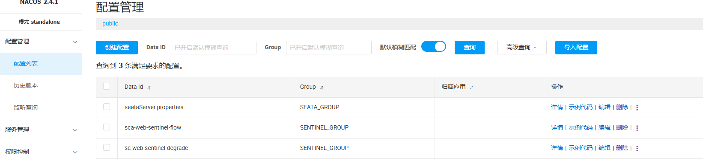
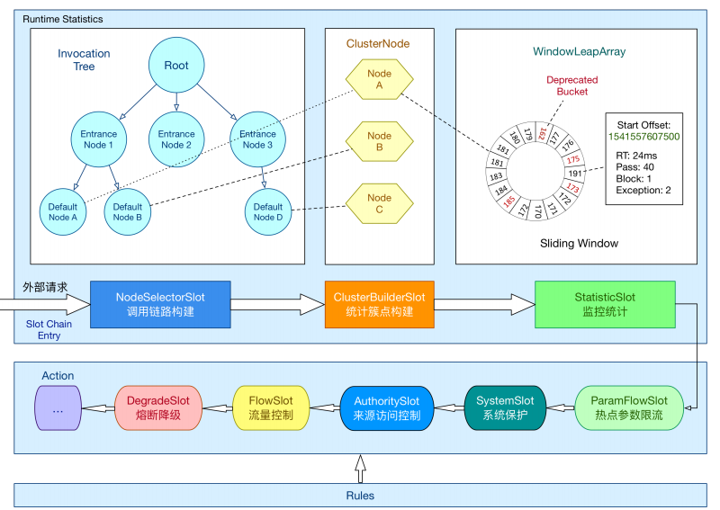

# 主要涉及到本项目依赖工具的部署安装

## docker部署
参考 docker-compose路径下部署 ，直接docker拉取镜像下载

## 安装包部署

因为现在docker 拉取镜像很多都存在问题，下面的依赖工具，就会基于安装包部署

### nacos


### kafka


### ES


### kibana


### seata
镜像配置参考docker-compose


在 Nacos 中导入 Seata 配置

访问 Nacos 控制台 http://服务器IP:8848/nacos，手动创建配置：
Data ID：seataServer.properties
Group：SEATA_GROUP
格式：Properties


配置内容

# 事务组映射（与客户端 application.yml 中保持一致）
service.vgroupMapping.default_tx_group=default

# 存储模式：db
store.mode=db
store.db.datasource=druid
store.db.dbType=mysql
store.db.driverClassName=com.mysql.cj.jdbc.Driver
#连接参数中的rewriteBatchedStatements为true时，在执行executeBatch，并且操作类型为 insert时，jdbc驱动会把对应的SQL优化成`insert into () values (), ()`的形式来提升批量插入的性能。
store.db.url=jdbc:mysql://mysql8:3306/seata?useUnicode=true&rewriteBatchedStatements=true&serverTimezone=Asia/Shanghai
store.db.user=website
store.db.password=website1020
store.db.minConn=5
store.db.maxConn=30
store.db.globalTable=global_table
store.db.branchTable=branch_table
store.db.distributedLockTable=distributed_lock
store.db.queryLimit=100
store.db.lockTable=lock_table
store.db.maxWait=5000

# 事务超时时间（秒）
server.recovery.committingRetryPeriod=1000
server.recovery.asynCommittingRetryPeriod=1000
server.recovery.rollbackingRetryPeriod=1000
server.recovery.timeoutRetryPeriod=1000
server.maxCommitRetryTimeout=-1
server.maxRollbackRetryTimeout=-1
server.rollbackRetryTimeoutUnlockEnable=false

# 事务组默认超时时间（秒）
server.distributedLockExpireTime=10000

### 限流组件 - Sentinel

镜像配置参考 docker-compose/sentinel 目录

**启动命令：**
```bash
cd docker-compose/sentinel
bash sentinel.sh
```

**访问控制台：**
- 地址：http://服务器IP:8858
- 账号：sentinel / sentinel

**方案对比：**

| 方案 | 定位 | 优势 | 劣势 | 企业采用度 |
|------|------|------|------|-----------|
| **Sentinel** | 流量治理+熔断降级 | 与 Spring Cloud Alibaba 生态无缝集成、控制台可视化、规则动态推送 | 仅 Java 生态 | 国内企业首选 |
| **Resilience4j** | 轻量级容错库 | 轻量、函数式 API、Spring Boot 3 原生支持 | 无控制台、需自行持久化规则 | 国外项目多 |
| **Spring Cloud Gateway** | 网关层限流 | 基于 Redis + Lua，网关统一入口限流 | 仅限网关层，无法细粒度控制服务内部 | 配合 Sentinel 使用 |
| **APISIX / Kong** | API 网关 | 高性能、插件化、多语言 | 运维成本高、与 Java 生态集成弱 | 多语言/异构系统 |

**核心能力：**

| 能力 | 说明 |
|------|------|
| **流控** | QPS 限流、并发线程数限流、调用关系限流 |
| **熔断降级** | 慢调用比例、异常比例、异常数 |
| **系统保护** | CPU 使用率、系统负载、全局 QPS |
| **热点参数** | 针对某个参数值限流（如某个用户 ID 的请求频率） |
| **授权控制** | 黑白名单 |

nacos配置sentinel 限流，熔断，授权规则
参见docker-compose/sentinel目录下 sca-web-sentinel-degrade.json、sca-web-sentinel-flow.json和sca-web-sentinel-authority.json

授权规则（来源访问控制）：sca-web 从请求头 originSource 解析请求来源，只放行白名单来源（sc-web），其它来源返回 403。规则配置在 Nacos（data-id: sca-web-sentinel-authority，group: SENTINEL_GROUP）。




## nacos 基础配置


对比三个微服务（sca-web/sca-order/sca-stock），配置重复度非常高。分析一下：

| 配置块 | 三服务是否一致 | 处理方式 |
|---|---|---|
| `mybatis-plus` | 完全一致 | → Nacos 共享 |
| `springdoc` | 完全一致 | → Nacos 共享 |
| `seata` | 完全一致（用 `${spring.application.name}`） | → Nacos 共享 |
| `spring.datasource` driver/user/pwd | 一致 | → Nacos 共享 |
| `spring.datasource.url` | **数据库名不同** | → 共享模板 + `${mysql.db}` 参数化 |
| `server.port` | 各服务不同 | 保留本地 |
| `security` | 仅 sca-web 有 | 保留本地 |
| `logging` | 仅 sca-web 有 | 保留本地 |


**Step 1: 三个服务的 bootstrap.yml 添加 shared-configs**


**Step 2: 精简三个服务的 application.yml**


**Step 3: 创建 Nacos 共享配置模板**


**配置层级架构**

```
Nacos 配置中心
├── sca-common.yml (SHARED_GROUP)     ← 新建：三服务共享
├── sca-web.yml    (DEFAULT_GROUP)    ← 已有：sca-web 专属
├── sca-order.yml  (DEFAULT_GROUP)    ← 已有：sca-order 专属
└── sca-stock.yml  (DEFAULT_GROUP)    ← 已有：sca-stock 专属

本地 bootstrap.yml
└── shared-configs → 引用 sca-common.yml (SHARED_GROUP)

本地 application.yml
└── 仅保留服务私有配置（端口、数据库名、安全配置等）
```

**优先级（低→高）**


```
优先级低 ─────────────────────────────────────────────── 优先级高

shared-configs  <  extension-configs  <  主配置(Nacos)  <  本地 application.yml
(sca-common.yml)   (扩展配置,按index)    (sca-web.yml)      (最高优先级)
```

具体规则：

| 配置来源 | 优先级 | 说明 |
|---|---|---|
| `shared-configs` | 最低 | 多个服务共享的基线配置 |
| `extension-configs` | 中 | **index 越大优先级越高**，后面的覆盖前面的 |
| 本地 `application.yml` | **高** | 本地配置永远优先，覆盖所有 Nacos 配置 |
| 主配置 (`prefix` + `file-extension`) | 最高 | 如 `sca-web.yml`，覆盖 shared 和 extension |


所以 `sca-web.yml`（Nacos 主配置）的优先级是**低于**本地 `application.yml` 的。本地 `application.yml` 是最终兜底，能覆盖所有 Nacos 来源的配置。


本地配置始终优先，共享配置作为基线。

**移入 Nacos 共享的配置**

| 配置块 | 说明 |
|---|---|
| `spring.datasource` driver/user/pwd | 三服务完全一致 |
| `mybatis-plus` | 三服务完全一致 |
| `springdoc` | 三服务一致 |
| `seata` | 三服务一致（`application-id` 用 `${spring.application.name}` 自动适配） |
| `spring.main.allow-bean-definition-overriding` | 三服务一致 |

**各服务保留本地的配置**

| 服务 | 保留内容 |
|---|---|
| **sca-web** | `server.port=8080`、`mysql.db=sca_db`、`security`（JWT+放行）、`logging` |
| **sca-order** | `server.port=8081`、`mysql.db=sca_order_db` |
| **sca-stock** | `server.port=8082`、`mysql.db=sca_stock_db` |

**数据库名参数化**

各服务 `application.yml` 通过 `mysql.db` 参数指定自己的数据库名，共享配置的 datasource URL 使用 `${mysql.db}` 占位符，各服务覆盖即可。

**Nacos 控制台创建配置**

需要在 Nacos 控制台创建 1 个配置项：

| Data ID | Group | 格式 |
|---|---|---|
| `sca-common.yml` | `SHARED_GROUP` | YAML |

内容模板文件：[docker-compose/nacos/sca-common.yml](file:///e:\project\opensabre\springalibabadmin\SpringCloudAdmin\docker-compose\nacos\sca-common.yml)

直接把该文件内容（跳过顶部注释）粘贴到 Nacos 配置编辑器中，点击**发布**即可。

热点规则需要使用@SentinelResource("resourceName")注解，否则不生效
参数必须是7种基本数据类型才会生效, 常用于热点商品
